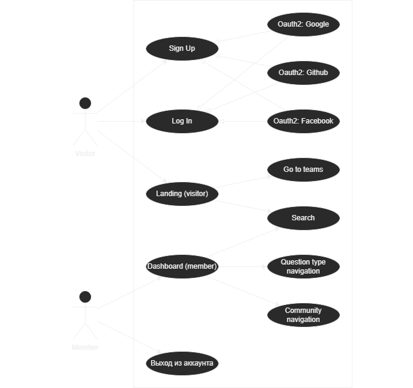

# Stacking Selenium
My first Selenium WebDriver project, made as a university homework on Software Testing. The goal was to explore [stackoverflow.com](https://stackoverflow.com), find and describe [use-cases](#use-case-diagram), form a [coverage checklist](#coverage-checklist), write out and implement [test scenarios](#test-scenarios-free-form)

Implementation is done with:
- Java 11
- JUnit 5.7.1
- Selenium 4.12.1

Tests are done using XPath, so they might not break for a while, but changes to the site itself will cause them to break. Last successful run was performed on September 23rd, 12023 [HE](https://en.wikipedia.org/wiki/Holocene_calendar)

### Use-case diagram

### Coverage checklist
- [x] Navigation from the landing page
- [x] Log in checks:
  - [x] Partially filled fields produce correct errors
  - [x] Incorrectly filled fields produce correct errors
  - [x] Login and password verification works
  - [x] Upon successful authorization, site switches to a member's view
- [x] Registration checks:
  - [x] Partially filled fields produce correct errors
  - [x] Incorrectly filled fields produce correct errors
  - [x] Security requirements for the password are enforced
  - [x] It is impossible to register without entering the captcha
- [x] Authorization/registration via social networks checks:
  - [x] The Google button sends to the correct page with the correct return code
  - [x] The GitHub button sends to the correct page with the correct return code
  - [x] The Facebook button sends to the correct page with the correct return code
- [x] Search works:
    - [x] For regular text sequences
    - [x] For text sequences with URL-unsafe characters
    - [x] For tags, forwarding to another page view
    - [x] For `[]`, which is recognized as text and not a tag
- [x] Member on the main page can:
  - [x] Switch between sections
  - [x] Switch between question tabs
  - [x] Visit meta.stackoverflow.com from the same account
  - [x] Go to their profile
  - [x] Log out (go to logout page)
- [x] Logout:
  - [x] Authorized user can log out
  - [x] Unauthorized user is automatically redirected to the main page

### Test scenarios (free form)
#### Transitions from the main page header
- Initial condition: visitor is on the main page
- In the header, click on:
  - About, get redirected to `https://stackoverflow.co`
  - For teams, get redirected to `https://stackoverflow.co/teams/`
  - Log in, get redirected to `/users/login`
  - Sign up, get redirected to `/users/signup`

#### Transitions from the main page body
- Initial condition: visitor is on the main page
- In the header, click on:
  - Discover teams, get redirected to `https://stackoverflow.co/teams/`
  - Search content, get redirected to `/questions`
  - Join the community, get redirected to `/users/signup`

#### Search
- Initial condition: visitor is on the main page
- Scenarios:
  - Enter a regular string, get redirected to keyword search
  - Enter a string with special characters, get redirected to keyword search, and the query will be correctly encoded in the URL
  - Enter a line with a tag (for example, `[kotlin]`), get redirected to `/questions/tags/kotlin`, with indication about singe-tag search, reflected in headings
  - Enter a line with several tags (for example, `[kotlin] [java]`), get redirected to `/questions/tags/kotlin+java`, with indication about multi-tag search
  - Enter a line with an empty tag (`[]`), get redirected to search for the keyword `[]`, and the URL will be `%5B%5D`, just like a regular line with special characters

#### Authorization (email)
- Initial condition: visitor is on the authorization page is open (`/users/login`)
- Scenarios:
  - Enter only password, error `Email cannot be empty` is displayed
  - Enter only email, error `Password cannot be empty` is displayed
  - Enter an incorrect email (`test`), error `The email is not a valid email address` is displayed
  - Enter real user's email and a wrong password, error `The email or password is incorrect` is displayed
  - Enter real user's email and password, authorization is successful

#### Registration (email)
- Initial condition: visitor is on the registration page is open (`/users/signup`)
- Scenarios:
  - Enter only password, error `Email cannot be empty` is displayed
  - Enter only email, error `Password cannot be empty` is displayed
  - Enter an incorrect email (`test`), error `The email is not a valid email address` is displayed
  - Enter a password that does not meet security requirements (`test`), error `make your password stronger` is displayed
  - Enter correct email and password, error stating that a captcha must be entered is displayed
  - (Positive scenario was not tested to not create random accounts on stackoverflow)

#### OAuth redirects
- Initial condition: visitor is on the authorization page (`/users/login`) or the registration page (`/users/signup`)
- Scenarios:
  - Click the button from `google`, get redirected to `https://accounts.google.com/*`, and URL contains the address of the requesting site (`stackauth.com`)
  - Click the button from `github`, get redirected to `https://github.com/*`, and URL contains the address of the requesting site (`stackauth.com`)
  - Click the button from `facebook`, get redirected to `https://www.facebook.com/*`, and URL contains the address of the requesting site (`stackauth.com`)

#### Moving through site sections for members
- Initial condition: member is on the main page
- Scenarios:
  - Click on `Questions` in the left menu, get redirected to `/questions`
  - Click on `Tags` in the left menu, get redirected to `/tags`
  - Click on `Users` in the left menu, get redirected to `/users`
  - Click on `Companies` in the left menu, get redirected to `/jobs/companies`
  - Click on `Explore Collectives` in the left menu, get redirected to `/collectives`

#### Navigate through site categories for members
- Initial condition: member is on the main page
- Scenarios:
  - Click on `Interesting` in the central right menu, get redirected to `/?tab=interesting`
  - Click on `Bountied` in the central right menu, get redirected to `/?tab=bounties`
  - Click on `Hot` in the central right menu, get redirected to `/?tab=hot`
  - Click on `Week` in the central right menu, get redirected to `/?tab=week`
  - Click on `Month` in the central right menu, get redirected to `/?tab=month`

#### Transitions from main page for members
- Initial condition: member is on the main page
- Scenarios:
  - Click on the user icon, get redirected to `/users/{user_id}/{username}`
  - Click on the rightmost icon, a submenu of communities opens

#### Using the communities submenu
- Initial condition: member is on the main page and the communities submenu is open
- Scenarios:
  - Click on `Meta Stack Overflow`, get redirected to `https://meta.stackoverflow.com/` with the same authorization
  - Click on `log out`, get redirected to `/users/logout`

#### Logging out as a member
- Initial condition: member is on the `/users/logout` page
- Scenario: click the `Log out` button, a log-out happens, get redirected to the main page

#### Logging out as a vistor
- Scenario: go to the `/users/logout` page without authorization, get redirected to the main page automatically
